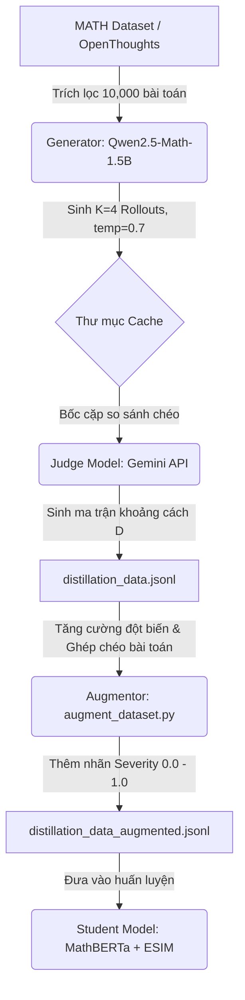
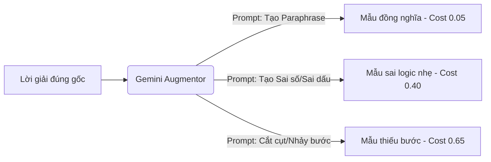

# Hướng dẫn Thiết kế & Cải tiến Dữ liệu Chưng cất (Logical Alignment Distillation Data Guide)

Tài liệu này trình bày thiết kế chi tiết cho quy trình sinh dữ liệu huấn luyện (Offline Data Generation) cho Student Model, tích hợp mô hình trọng tài **Gemini API** làm Judge Model và cấu trúc phân bổ các trường hợp kiểm thử (Severity Spectrum) nhằm tối ưu hóa khả năng nhận diện logic của mô hình.

---

## 1. Kiến trúc Tổng quan Quy trình (Data Pipeline)

Quy trình tạo dữ liệu gồm 3 bước khép kín từ sinh mẫu (Generation), chấm điểm (Judging) đến tăng cường (Augmentation):



---

## 2. Tích hợp Gemini làm Judge Model

Việc chuyển đổi từ mô hình cục bộ (Qwen2.5-7B-AWQ) sang **Gemini API** (ví dụ: `gemini-2.5-flash` hoặc `gemini-2.5-pro`) mang lại các lợi thế vượt trội:
* **Hiểu biết toán học sâu sắc:** Khả năng suy luận ngữ nghĩa và bắt lỗi logic toán học của Gemini vượt trội hơn hẳn các mô hình 7B cục bộ.
* **Hỗ trợ Context lớn:** Không lo lỗi tràn cửa sổ ngữ cảnh khi so sánh các cặp rollout dài.
* **Chi phí & Tốc độ:** Gọi qua API giúp giảm tải phần cứng GPU chạy cục bộ cho Judge, tối ưu hóa VRAM để chạy vLLM Generator.

### System Prompt cho Gemini Judge (Tích hợp Ground Truth)
Để tối ưu hóa độ chính xác và giảm thiểu hiện tượng ảo tưởng (hallucination) của mô hình trọng tài, **việc đưa thêm lời giải mẫu chuẩn (Ground Truth - GT) của đề bài vào Prompt là CỰC KỲ KHUYÊN DÙNG**. 

#### Tại sao nên đưa Ground Truth vào Judge?
1. **Làm điểm neo logic (Logical Anchor):** Gemini không cần tự giải bài toán từ đầu (giảm thiểu sai sót tính toán của chính Judge). Nó chỉ cần dùng GT làm thước đo chuẩn để soi chiếu xem các bước đi trong Rollout A và Rollout B có đúng hướng hay không.
2. **Nhận diện lỗi sai tốt hơn:** Nếu cả hai Rollout A và B đều kết luận sai, hoặc một trong hai đi lệch hướng, Gemini dễ dàng đối chiếu với GT để phát hiện ra chính xác bước nào bắt đầu chệch hướng logic, giúp gán nhãn `0.8 - 1.0` nhạy bén hơn.

#### System Prompt cấu hình Judge (Thang điểm Liên tục 0.0 - 1.0 + Ground Truth)
```text
You are an expert Logical Alignment Judge for mathematical reasoning.
Your task is to evaluate two different reasoning trajectories (Rollout A and Rollout B) against the provided Ground Truth Solution for the same problem.
You must ignore any differences in vocabulary, grammar, or verbosity. Focus strictly on the LOGICAL and ALGEBRAIC equivalence of the steps.

INSTRUCTIONS FOR GRANULAR SCORING (Scale from 0.0 to 1.0 with step 0.1):
1. Decompose both Rollout A and Rollout B into major logical steps.
2. Refer to the provided Ground Truth Solution to verify the correctness of the steps in both Rollouts.
3. Compare each step of Rollout A against each step of Rollout B.
4. Evaluate logical similarity on a granular spectrum from 0.0 (identical logic) to 1.0 (completely unrelated/contradictory):
   - 0.0: Perfect mathematical equivalence (even if phrased differently or using different symbols).
   - 0.1 - 0.2: Mathematically equivalent, but uses slightly different notations, or includes a redundant minor step.
   - 0.3 - 0.4: Correct final steps but one uses a different mathematical method (which you verify against the Ground Truth as also correct), leading to moderate deviation in intermediate steps.
   - 0.5 - 0.6: Minor arithmetic typo (e.g., 2+3=6), notation slip, or a skipped step that does not break the entire proof.
   - 0.7 - 0.8: Severe logical errors, critical step skip, or wrong final answer despite having similar starting steps.
   - 0.9 - 1.0: Completely wrong, contradictory logic, or unrelated mathematical statements.

Input Format Provided to You:
Problem: [Problem Description]
Ground Truth Solution: [Ground Truth Solution]
Rollout A: [Rollout A steps]
Rollout B: [Rollout B steps]

Output your evaluation purely as a 2D JSON array representing the pairwise distance matrix of size N x M (where N is the number of steps in Rollout A, and M is the number of steps in Rollout B). 
NO EXTRA TEXT. ONLY THE JSON ARRAY.

Example Output:
[
  [0.0, 0.8, 1.0],
  [0.7, 0.2, 0.9],
  [1.0, 0.9, 0.1]
]
```

---


## 3. Thang đo Phân bố Lệch logic (Alignment Cost Spectrum)

Để mô hình Student không bị "loạn điểm" giữa lỗi từ vựng (Lexical Shift) và lỗi logic thực sự, dữ liệu huấn luyện cần được thiết kế theo thang đo nghiêm ngặt sau:

| STT | Loại Cặp Câu (Pair Type) | Đặc điểm Cấu trúc & Logic | Target Cost | Cách tạo trong Pipeline |
| :--- | :--- | :--- | :--- | :--- |
| **1** | **Khớp hoàn hảo (Perfect Match)** | Cùng cách giải, cấu trúc câu chữ giống nhau hoàn toàn. | **0.00** | Ghép đôi Rollout với chính nó (Self-pair). |
| **2** | **Đồng nghĩa viết lại (Paraphrase)** | Cùng cách giải và kết quả, nhưng thay đổi từ nối, từ vựng hoặc đảo cấu trúc ngữ pháp. | **0.05** | Dùng LLM viết lại các bước giải mà không đổi toán học. |
| **3** | **Khác phương pháp (Alt Strategy)** | Cùng ra kết quả đúng nhưng giải bằng 2 phương pháp khác nhau (ví dụ: Factoring vs $\Delta$). | **0.20** | Cặp rollouts đúng do Generator sinh ra dùng thuật toán khác nhau. |
| **4** | **Sai logic toán học (Logic Error)** | Sai dấu biểu thức, tính sai nghiệm, hoặc bước biến đổi biến cố sai. | **0.40 - 0.50** | Dùng các hàm đột biến (`mutate_sign`, `mutate_keyword`, `mutate_negation`). |
| **5** | **Chưa giải xong (Incomplete)** | Bị cắt ngắn nửa chừng, thiếu kết luận cuối. | **0.60 - 0.70** | Dùng hàm `mutate_shortcut` hoặc cắt bỏ các bước cuối cùng. |
| **6** | **Lạc đề hoàn toàn (Cross-Problem)** | Hai lời giải thuộc hai đề bài hoàn toàn khác nhau (ví dụ Đại số vs Xác suất). | **1.00** | **[MỚI]** Bốc ngẫu nhiên Rollout bài $X$ ghép với Rollout bài $Y$ ($X \neq Y$). |

---

## 4. Giải pháp Tăng cường dữ liệu bằng LLM (Gemini Augmentation Workflow)

Thay vì sử dụng các hàm Regex đột biến thô sơ dễ làm hỏng cú pháp câu hoặc tạo ra các lỗi phi thực tế, chúng ta sẽ chuyển hướng sang dùng **Gemini API** để trực tiếp sinh ra các biến thể đột biến (Mutations) thông minh và tự nhiên cho các lời giải toán.



### A. Gemini Prompt dùng cho Augmentation

Chúng ta có thể cấu hình các system prompt khác nhau để bắt Gemini sinh ra các loại đột biến có kiểm soát:

#### 1. Sinh lỗi logic toán học (Math Logic Mutation - Target Cost: 0.40)
```text
You are a mathematical code augmentor. 
Your task is to take a correct multi-step math solution (LaTeX formatting) and introduce EXACTLY ONE realistic mathematical/arithmetic mistake (e.g., sign inversion, incorrect addition, wrong exponent simplification) in the intermediate steps. 
Ensure the rest of the writing flow is natural and grammatically correct. Do NOT make the final answer correct.

Input: [Correct Solution]
Output: [Mutated Solution with 1 Logic Error]
```

#### 2. Sinh lời giải thiếu bước (Incomplete Mutation - Target Cost: 0.65)
```text
You are a mathematical code augmentor.
Your task is to take a correct multi-step math solution and truncate it. Either stop the explanation abruptly before concluding the final answer, or completely skip 2 intermediate steps and directly output an unproven or wrong final answer.

Input: [Correct Solution]
Output: [Truncated/Incomplete Solution]
```

#### 3. Viết lại đồng nghĩa (Paraphrase - Target Cost: 0.05)
```text
You are a mathematical writing assistant.
Your task is to rewrite the given correct multi-step solution. Change the connecting words (e.g., 'therefore', 'hence'), simplify or expand the verbal explanations, but keep the underlying mathematical equations and the logical steps 100% identical and correct.

Input: [Correct Solution]
Output: [Paraphrased Solution]
```

### B. Hàm Ghép chéo Bài toán (Cross-Problem Negatives - Target Cost: 1.00)
Hàm này bốc ngẫu nhiên các rollout từ các bài toán khác nhau trong batch để gán nhãn cứng `1.0`, triệt tiêu hoàn toàn lỗi nhận diện sai do cấu trúc step giống nhau:

```python
def apply_cross_problem_negatives(all_data, target_output_file):
    # Trích xuất ngẫu nhiên các rollout từ các bài toán khác nhau
    problems = list(all_data.keys())
    for prob_id in all_data:
        # Bốc ngẫu nhiên một bài toán khác
        other_prob_id = random.choice([p for p in problems if p != prob_id])
        rollout_a = random.choice(all_data[prob_id]['generated_rollouts'])
        rollout_b = random.choice(all_data[other_prob_id]['generated_rollouts'])
        
        # Tạo ma trận khoảng cách chứa toàn bộ giá trị 1.0 (Lạc đề tối đa)
        len_a = len(re.findall(r'(?i)(step\s+\d+)', rollout_a)) or 3
        len_b = len(re.findall(r'(?i)(step\s+\d+)', rollout_b)) or 3
        unrelated_matrix = [[1.0] * len_b for _ in range(len_a)]
        
        # Ghi vào tập dữ liệu tăng cường
        # ...
```
### C. Thứ tự Thực hiện Tối ưu: Judge trước -> Augment sau

Để tối ưu hóa chi phí API và tính chuẩn xác của nhãn, quy trình bắt buộc phải đi theo thứ tự: **Judge các mẫu gốc trước, sau đó mới tiến hành Augment (tăng cường) ngoại tuyến.**

#### Tại sao không nên Augment trước?
Nếu ta chạy Augment trước để sinh ra thêm $M$ bản đột biến cho mỗi rollout gốc, số lượng rollouts cho mỗi bài toán tăng từ $K=4$ lên $N=8$.
Khi so khớp chéo toàn bộ để tính ma trận $D$, số lượng cặp so sánh tăng theo hàm mũ bậc hai $O(N^2)$:
$$\binom{4}{2} = 6 \text{ cặp} \quad \longrightarrow \quad \binom{8}{2} = 28 \text{ cặp}$$
Với tập mẫu 10,000 bài toán, số cuộc gọi API lên Gemini Judge sẽ bùng nổ: **280,000 lượt gọi API**, gây lãng phí chi phí cực lớn.

#### Thiết kế luồng tối ưu (Judge trước -> Augment sau):
1. **Gemini Judge (Giai đoạn 1):** Chỉ chạy đối sánh chéo $K=4$ rollouts gốc thu được từ vLLM Generator. Chỉ tốn 6 cặp so sánh $\rightarrow$ 60,000 lượt gọi API.
2. **Augmentor (Giai đoạn 2 - Ngoại tuyến):** 
   - Sử dụng Gemini API (đơn lẻ, không so sánh) để sinh ra các đột biến (Paraphrase, Logic error, Truncation) cho các rollout gốc.
   - **Tự động suy luận ma trận khoảng cách mà không cần gọi API lần 2:**
     - *Cặp Paraphrase:* Nhân bản ma trận gốc từ Gemini Judge, gán các giá trị đường chéo khớp là `0.05`.
     - *Cặp đột biến lỗi bước (ví dụ phá hủy Step 2):* Dựa vào chỉ số bước bị sửa đổi, ta tự động cập nhật các hàng/cột tương ứng của Step 2 trong ma trận gốc thành `0.5` (lỗi nhẹ) hoặc `0.8` (lỗi nặng).
     - *Cặp ghép chéo bài toán (Cross-Problem):* Gán cứng ma trận khoảng cách là toàn bộ `1.0`.


---


## 5. Prompt cấu hình Chuẩn cho Generator (Qwen2.5-Math-1.5B)

Để mô hình Student học được cấu trúc bước suy luận một cách chuẩn xác, mô hình Generator (`Qwen2.5-Math-1.5B-Instruct`) cần được hướng dẫn cụ thể bằng một System Prompt đặc thù. Prompt này đảm bảo mô hình luôn sinh ra các lời giải được định dạng theo cấu trúc các bước rõ ràng (`Step 1:`, `Step 2:`, ...) thay vì viết tự do theo khối văn bản và sử dụng đúng ký pháp LaTeX chuẩn.

### System Prompt cho Generator (`GENERATION_PROMPT`)

```text
You are an expert mathematical assistant. Your task is to solve the given math problem step-by-step.
To ensure clarity and logical alignment, you MUST strictly adhere to the following formatting rules:

1. STRUCTURE: Decompose your reasoning into explicit, sequential steps. Start each step with "Step X: " where X is the step number (e.g., "Step 1: ", "Step 2: ").
2. SINGLE LOGICAL STEP: Each step must contain exactly one logical or algebraic transformation, calculation, or deduction. Do not combine multiple different calculations into a single step.
3. MATH FORMATTING: All mathematical expressions, equations, variables, and formulas MUST be enclosed within standard LaTeX delimiters. Use \( ... \) for inline math and \[ ... \] for block equations. Do NOT use single or double dollar signs ($ or $$).
4. NO MARKDOWN HEADERS: Do not use markdown headers (like #, ##) or bullet points inside the steps. Keep the explanation concise and direct.

Example Format:
Step 1: We are given the quadratic equation \(x^2 - 5x + 6 = 0\).
Step 2: Factoring the quadratic expression, we get \((x-2)(x-3) = 0\).
Step 3: Solve for \(x\) by setting each factor to zero, which gives \(x = 2\) or \(x = 3\).
```

### Tại sao Setting này quan trọng?
1. **Đồng bộ hóa Token Alignment:** MathBERTa và cấu trúc so khớp của Student Model rất nhạy cảm với các cụm neo tiêu đề (`Step 1:`, `Step 2:`). Việc chuẩn hóa này giúp Cross-Attention tập trung đúng vào nội dung toán học nằm sau mỗi neo tiêu đề.
2. **Hỗ trợ quá trình đột biến (Mutation):** Khi cấu trúc bước đồng đều, việc tự động đột biến (như nhảy bước, đổi dấu bước trung gian) sẽ diễn ra trơn tru và dễ lập trình nhãn cứng hơn rất nhiều.

---

## 6. Lưu ý Tối ưu hóa Quy trình (Pipeline Refinements)

Mặc dù bản thiết kế rất xuất sắc, bạn nên lưu ý 3 điểm sau khi triển khai thực tế để quy trình đạt độ "hoàn hảo":

### A. Đảm bảo cấu trúc đầu ra bằng Gemini Structured Outputs (Khuyên dùng)
Thay vì sử dụng Regex để tách chuỗi phản hồi (dễ gặp lỗi nếu mô hình sinh định dạng không chuẩn), chúng ta nên tận dụng tính năng **Structured Outputs** chính chủ của Gemini API bằng cách cấu hình tham số `response_mime_type` và `response_schema`.

* **Cách cấu hình cấu trúc Schema (ví dụ bằng Python SDK của Google GenAI):**
  Chúng ta sẽ khai báo kiểu dữ liệu trả về bắt buộc phải là một mảng 2 chiều chứa các số thực (List of Lists of Floats):

  ```python
  from google import genai
  from google.genai import types

  client = genai.Client()

  # Định nghĩa cấu trúc mảng 2D cho ma trận khoảng cách
  dist_matrix_schema = types.Schema(
      type=types.Type.ARRAY,
      description="Ma trận khoảng cách logic 2 chiều kích thước N x M giữa các bước của hai Rollout.",
      items=types.Schema(
          type=types.Type.ARRAY,
          items=types.Schema(
              type=types.Type.NUMBER,
              description="Khoảng cách logic từ 0.0 đến 1.0 (bước nhảy 0.1)."
          )
      )
  )

  response = client.models.generate_content(
      model='gemini-2.5-flash',
      contents=prompt,
      config=types.GenerateContentConfig(
          response_mime_type="application/json",
          response_schema=dist_matrix_schema,
          temperature=0.0
      ),
  )

  # Đầu ra cam kết là JSON sạch 100% khớp đúng Schema
  distance_matrix = json.loads(response.text)
  ```


### B. Sự nhất quán của LaTeX (LaTeX Consistency)
Để mô hình Student không bị nhiễu và phân mảnh tokens do sự khác biệt giữa ký tự `$` và `\( ... \)`:
* **Giải pháp:** Ràng buộc chặt chẽ trong Prompt của cả **Qwen Generator** và **Gemini Augmentor** là chỉ sử dụng định dạng `\( ... \)` cho inline math và `\[ ... \]` cho block math. Việc đồng bộ này giúp loại bỏ hoàn toàn sự phụ thuộc vào các hàm convert thủ công và giữ độ sạch cao cho tokenizer.

### C. Kiểm soát Độ nghiêm trọng của Lỗi (Severity Control)
Khi sử dụng Gemini để sinh lỗi (Mutation), đôi khi mô hình sinh ra lỗi quá "tinh vi" (chỉ sai lệch rất nhỏ về ngữ nghĩa chuyên sâu) khiến mô hình Student có kích thước nhỏ (110M) không thể nhận diện được, làm suy yếu tín hiệu Gradient.
* **Giải pháp:** Thêm chỉ dẫn cảnh báo trong Prompt của Gemini Augmentor: *"Make the mistake obvious but realistic"* (Tạo lỗi rõ ràng nhưng thực tế) để tạo ra tín hiệu sai lệch đủ mạnh, giúp mô hình Student học nhanh và hội tụ hiệu quả hơn.

---

## 7. Kết luận & Tác động

Sự kết hợp giữa **Gemini API làm Judge**, **Phổ dữ liệu phân tầng (Severity Spectrum)**, và **Prompt Generator Chuẩn hóa** sẽ giúp:
1. **Student Model hội tụ thông minh hơn:** Không còn nhầm lẫn giữa sự khác biệt từ vựng bình thường (Lexical Shift) và lỗi logic toán học.
2. **Kháng nhiễu OOD:** Phạt tối đa các lời giải lạc đề, giúp vòng lặp GRPO loại bỏ các câu trả lời hallucinate (ảo tưởng) của Actor.
3. **Ổn định hệ số Kendall Tau:** Tăng cường khả năng xếp hạng chính xác mức độ logic của mô hình lên $>0.70$.


