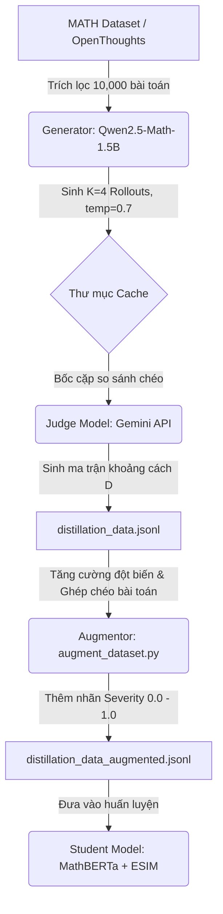
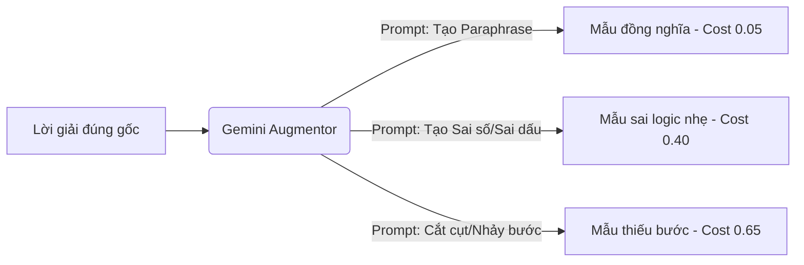

# Hướng dẫn Thiết kế & Cải tiến Dữ liệu Chưng cất (Logical Alignment Distillation Data Guide)

Tài liệu này trình bày thiết kế chi tiết cho quy trình sinh dữ liệu huấn luyện (Offline Data Generation) cho Student Model, tích hợp mô hình trọng tài **Gemini API** làm Judge Model và cấu trúc phân bổ các trường hợp kiểm thử (Severity Spectrum) nhằm tối ưu hóa khả năng nhận diện logic của mô hình.

---

## 1. Kiến trúc Tổng quan Quy trình (Data Pipeline)

Quy trình tạo dữ liệu gồm 3 bước khép kín từ sinh mẫu (Generation), chấm điểm (Judging) đến tăng cường (Augmentation):



---

## 2. Tích hợp Gemini làm Judge Model

Việc chuyển đổi từ mô hình cục bộ sang **Gemini API** (ví dụ: `gemini-2.5-flash`) mang lại các lợi thế vượt trội về khả năng hiểu ngữ nghĩa toán học và hỗ trợ context lớn.

### Đánh giá Không phụ thuộc Đề bài và Lời giải mẫu (Zero-Knowledge Alignment)
Quy trình hiện tại chọn giải pháp **đánh giá sự tương đồng logic trực tiếp giữa Rollout A và Rollout B mà không truyền vào đề bài hoặc Lời giải mẫu (Ground Truth)**. Đây là một quyết định thiết kế quan trọng nhằm:
1. **Tiết kiệm tối đa Tokens**: Giảm được 60% lượng input token do không phải gửi kèm đề bài và lời giải mẫu dài.
2. **Đơn giản hóa Pipeline**: Không cần thực hiện ánh xạ đề bài phức tạp từ các bộ dữ liệu khác nhau.
3. **Tập trung vào cấu trúc logic**: Judge chỉ tập trung so sánh xem hai chuỗi hành động biến đổi toán học có tương đương nhau về mặt đại số/logic hay không, bất kể chúng đúng hay sai so với đề gốc.

### System Prompt cấu hình Judge (Thang điểm Liên tục 0.0 - 1.0)
```text
You are an expert Logical Alignment Judge for mathematical reasoning trajectories.
Your task is to evaluate the logical alignment step-by-step between two different trajectories (Rollout A and Rollout B) solving the same problem.
You must ignore any differences in vocabulary, grammar, or verbosity. Focus strictly on the LOGICAL and STRUCTURAL equivalence of the steps.

CRITICAL RULE: Do NOT evaluate whether the steps are correct or incorrect relative to the problem. You must ignore whether the steps contain arithmetic errors or wrong conclusions. Focus ONLY on whether the two steps are performing the same mathematical action, algebraic transformation, or logical deduction.

INSTRUCTIONS FOR GRANULAR SCORING:
1. Decompose both Rollout A and Rollout B into major logical steps based on the step headers (e.g., "Step 1:", "Step 2:").
2. Compare each step of Rollout A against each step of Rollout B.
3. Evaluate logical similarity by choosing EXACTLY one of the following scores:
   - 0.0: Perfect structural and logical equivalence. The two steps are doing the exact same mathematical action (even if they use different words or if BOTH make the exact same error).
   - 0.2: Extremely similar logic, but uses slightly different notations, or includes a redundant minor simplification step.
   - 0.4: The steps share a similar goal but one uses a slightly different algebraic path or method to get there.
   - 0.6: Minor structural deviation, such as skipping a minor sub-step or rearranging intermediate expressions.
   - 0.8: Severe structural differences, focusing on completely different mathematical concepts or parts of the problem.
   - 1.0: Completely unrelated steps, or step content that has absolutely no logical overlap.

Output your evaluation purely as a 2D JSON array representing the pairwise distance matrix. 
NO EXTRA TEXT. ONLY THE JSON ARRAY.
```

### Định dạng Input gửi lên Gemini Judge
```text
Compare step-by-step logical alignment between:
Rollout A (has N steps):
- A1: [Content of Step 1]
- A2: [Content of Step 2]
...
Rollout B (has M steps):
- B1: [Content of Step 1]
- B2: [Content of Step 2]
...

You MUST return a 2D JSON array of size exactly N x M (containing N rows, where each row has exactly M numbers between 0.0 and 1.0).
Do NOT explain. Do NOT add any text other than the JSON array.
```

---


## 3. Thang đo Phân bố Lệch logic (Alignment Cost Spectrum)

Để mô hình Student không bị "loạn điểm" giữa lỗi từ vựng (Lexical Shift) và lỗi logic thực sự, dữ liệu huấn luyện cần được thiết kế theo thang đo nghiêm ngặt sau:

| STT | Loại Cặp Câu (Pair Type) | Đặc điểm Cấu trúc & Logic | Target Cost | Cách tạo trong Pipeline |
| :--- | :--- | :--- | :--- | :--- |
| **1** | **Khớp hoàn hảo (Perfect Match)** | Cùng cách giải, cấu trúc câu chữ giống nhau hoàn toàn. | **0.00** | Ghép đôi Rollout với chính nó (Self-pair). |
| **2** | **Đồng nghĩa viết lại (Paraphrase)** | Cùng cách giải và kết quả, nhưng thay đổi từ nối, từ vựng hoặc đảo cấu trúc ngữ pháp. | **0.05** | Dùng LLM viết lại các bước giải mà không đổi toán học. |
| **3** | **Khác phương pháp (Alt Strategy)** | Cùng ra kết quả đúng nhưng giải bằng 2 phương pháp khác nhau (ví dụ: Factoring vs $\Delta$). | **0.20** | Cặp rollouts đúng do Generator sinh ra dùng thuật toán khác nhau. |
| **4** | **Sai logic toán học (Logic Error)** | Sai dấu biểu thức, tính sai nghiệm, hoặc bước biến đổi biến cố sai. | **0.40 - 0.50** | Tạo đột biến lỗi toán học (Math Logic Mutation) bằng Gemini API. |
| **5** | **Chưa giải xong (Incomplete)** | Bị cắt ngắn nửa chừng, thiếu kết luận cuối. | **0.60 - 0.70** | Tạo đột biến thiếu bước (Incomplete Mutation) bằng Gemini API. |
| **6** | **Lạc đề hoàn toàn (Cross-Problem)** | Hai lời giải thuộc hai đề bài hoàn toàn khác nhau (ví dụ Đại số vs Xác suất). | **1.00** | **[MỚI]** Bốc ngẫu nhiên Rollout bài $X$ ghép với Rollout bài $Y$ ($X \neq Y$). |

---

## 4. Giải pháp Tăng cường dữ liệu bằng LLM (Gemini Augmentation Workflow)

Thay vì sử dụng các hàm Regex đột biến thô sơ dễ làm hỏng cú pháp câu hoặc tạo ra các lỗi phi thực tế, chúng ta sẽ chuyển hướng sang dùng **Gemini API** để trực tiếp sinh ra các biến thể đột biến (Mutations) thông minh và tự nhiên cho các lời giải toán.



### A. Gemini Prompt dùng cho Augmentation

Chúng ta có thể cấu hình các system prompt khác nhau để bắt Gemini sinh ra các loại đột biến có kiểm soát:

#### 1. Sinh lỗi logic toán học (Math Logic Mutation - Target Cost: 0.40)
```text
You are a mathematical code augmentor. 
Your task is to take a correct multi-step math solution (LaTeX formatting) and introduce EXACTLY ONE realistic mathematical/arithmetic mistake (e.g., sign inversion, incorrect addition, wrong exponent simplification) in the intermediate steps. 
Ensure the rest of the writing flow is natural and grammatically correct. Do NOT make the final answer correct.

Input: [Correct Solution]
Output: [Mutated Solution with 1 Logic Error]
```

#### 2. Sinh lời giải thiếu bước (Incomplete Mutation - Target Cost: 0.65)
```text
You are a mathematical code augmentor.
Your task is to take a correct multi-step math solution and truncate it. Either stop the explanation abruptly before concluding the final answer, or completely skip 2 intermediate steps and directly output an unproven or wrong final answer.

Input: [Correct Solution]
Output: [Truncated/Incomplete Solution]
```

#### 3. Viết lại đồng nghĩa (Paraphrase - Target Cost: 0.05)
```text
You are a mathematical writing assistant.
Your task is to rewrite the given correct multi-step solution. Change the connecting words (e.g., 'therefore', 'hence'), simplify or expand the verbal explanations, but keep the underlying mathematical equations and the logical steps 100% identical and correct.

Input: [Correct Solution]
Output: [Paraphrased Solution]
```

### B. Hàm Ghép chéo Bài toán (Cross-Problem Negatives - Target Cost: 1.00)
Hàm này bốc ngẫu nhiên các rollout từ các bài toán khác nhau trong batch để gán nhãn cứng `1.0`, triệt tiêu hoàn toàn lỗi nhận diện sai do cấu trúc step giống nhau:

```python
def apply_cross_problem_negatives(all_data, target_output_file):
    # Trích xuất ngẫu nhiên các rollout từ các bài toán khác nhau
    problems = list(all_data.keys())
    for prob_id in all_data:
        # Bốc ngẫu nhiên một bài toán khác
        other_prob_id = random.choice([p for p in problems if p != prob_id])
        rollout_a = random.choice(all_data[prob_id]['generated_rollouts'])
        rollout_b = random.choice(all_data[other_prob_id]['generated_rollouts'])
        
        # Tạo ma trận khoảng cách chứa toàn bộ giá trị 1.0 (Lạc đề tối đa)
        len_a = len(re.findall(r'(?i)(step\s+\d+)', rollout_a)) or 3
        len_b = len(re.findall(r'(?i)(step\s+\d+)', rollout_b)) or 3
        unrelated_matrix = [[1.0] * len_b for _ in range(len_a)]
        
        # Ghi vào tập dữ liệu tăng cường
        # ...
```
### C. Thứ tự Thực hiện Tối ưu: Judge trước -> Augment sau

Để tối ưu hóa chi phí API và tính chuẩn xác của nhãn, quy trình bắt buộc phải đi theo thứ tự: **Judge các mẫu gốc trước, sau đó mới tiến hành Augment (tăng cường) ngoại tuyến.**

#### Tại sao không nên Augment trước?
Nếu ta chạy Augment trước để sinh ra thêm $M$ bản đột biến cho mỗi rollout gốc, số lượng rollouts cho mỗi bài toán tăng từ $K=4$ lên $N=8$.
Khi so khớp chéo toàn bộ để tính ma trận $D$, số lượng cặp so sánh tăng theo hàm mũ bậc hai $O(N^2)$:
$$\binom{4}{2} = 6 \text{ cặp} \quad \longrightarrow \quad \binom{8}{2} = 28 \text{ cặp}$$
Với tập mẫu 10,000 bài toán, số cuộc gọi API lên Gemini Judge sẽ bùng nổ: **280,000 lượt gọi API**, gây lãng phí chi phí cực lớn.

#### Thiết kế luồng tối ưu (Judge trước -> Augment sau):
1. **Gemini Judge (Giai đoạn 1):** Chỉ chạy đối sánh chéo $K=4$ rollouts gốc thu được từ vLLM Generator. Chỉ tốn 6 cặp so sánh $\rightarrow$ 60,000 lượt gọi API.
2. **Augmentor (Giai đoạn 2 - Ngoại tuyến):** 
   - Sử dụng Gemini API (đơn lẻ, không so sánh) để sinh ra các đột biến (Paraphrase, Logic error, Truncation) cho các rollout gốc.
   - **Tự động suy luận ma trận khoảng cách mà không cần gọi API lần 2:**
     - *Cặp Paraphrase:* Nhân bản ma trận gốc từ Gemini Judge, gán các giá trị đường chéo khớp là `0.05`.
     - *Cặp đột biến lỗi bước (ví dụ phá hủy Step 2):* Dựa vào chỉ số bước bị sửa đổi, ta tự động cập nhật các hàng/cột tương ứng của Step 2 trong ma trận gốc thành `0.5` (lỗi nhẹ) hoặc `0.8` (lỗi nặng).
     - *Cặp ghép chéo bài toán (Cross-Problem):* Gán cứng ma trận khoảng cách là toàn bộ `1.0`.


---


## 5. Prompt cấu hình Chuẩn cho Generator (Qwen2.5-Math-1.5B)

Để mô hình Student học được cấu trúc bước suy luận một cách chuẩn xác, mô hình Generator (`Qwen2.5-Math-1.5B-Instruct`) cần được hướng dẫn cụ thể bằng một System Prompt đặc thù. Prompt này đảm bảo mô hình luôn sinh ra các lời giải được định dạng theo cấu trúc các bước rõ ràng (`Step 1:`, `Step 2:`, ...) thay vì viết tự do theo khối văn bản và sử dụng đúng ký pháp LaTeX chuẩn.

### System Prompt cho Generator (`GENERATION_PROMPT`)

```text
You are an expert mathematical assistant. Your task is to solve the given math problem step-by-step.
To ensure clarity and logical alignment, you MUST strictly adhere to the following formatting rules:

1. STRUCTURE: Decompose your reasoning into explicit, sequential steps. Start each step with "Step X: " where X is the step number (e.g., "Step 1: ", "Step 2: ").
2. SINGLE LOGICAL STEP: Each step must contain exactly one logical or algebraic transformation, calculation, or deduction. Do not combine multiple different calculations into a single step.
3. MATH FORMATTING: All mathematical expressions, equations, variables, and formulas MUST be enclosed within standard LaTeX delimiters. Use \( ... \) for inline math and \[ ... \] for block equations. Do NOT use single or double dollar signs ($ or $$).
4. NO MARKDOWN HEADERS: Do not use markdown headers (like #, ##) or bullet points inside the steps. Keep the explanation concise and direct.

Example Format:
Step 1: We are given the quadratic equation \(x^2 - 5x + 6 = 0\).
Step 2: Factoring the quadratic expression, we get \((x-2)(x-3) = 0\).
Step 3: Solve for \(x\) by setting each factor to zero, which gives \(x = 2\) or \(x = 3\).
```

### Tại sao Setting này quan trọng?
1. **Đồng bộ hóa Token Alignment:** MathBERTa và cấu trúc so khớp của Student Model rất nhạy cảm với các cụm neo tiêu đề (`Step 1:`, `Step 2:`). Việc chuẩn hóa này giúp Cross-Attention tập trung đúng vào nội dung toán học nằm sau mỗi neo tiêu đề.
2. **Hỗ trợ quá trình đột biến (Mutation):** Khi cấu trúc bước đồng đều, việc tự động đột biến (như nhảy bước, đổi dấu bước trung gian) sẽ diễn ra trơn tru và dễ lập trình nhãn cứng hơn rất nhiều.

---

## 6. Các Cải tiến và Tối ưu hóa Thực tế trong Pipeline (Implemented Refinements)

Trong quá trình triển khai quy trình đánh giá thực tế với 500 bài toán, chúng ta đã phát triển các cơ chế tối ưu hóa vượt trội để đối phó với giới hạn API Rate Limit và lỗi cấu trúc phản hồi của LLM:

### A. Cơ chế Nạp bù và Cache mức độ từng Cặp (Pair-Level Incremental Caching)
* **Vấn đề:** Khi gửi song song nhiều yêu cầu, API có thể bị dính lỗi Rate Limit (429) ở một số cặp. Nếu bỏ qua cả bài toán hoặc ghi đè file trống, ta sẽ lãng phí token của các cặp đã chấm thành công trước đó.
* **Giải pháp:** Cập nhật `judge_demo.py` để quét kiểm tra ở mức độ từng cặp `(r_a, r_b)`.
  - Nếu file kết quả đã tồn tại nhưng có một số ma trận bị rỗng `[]` (lỗi 429 cũ), script sẽ **giữ lại toàn bộ ma trận thành công** và **chỉ gửi API chấm lại các cặp bị thiếu**.
  - Kết quả mới sẽ được gộp (merge) trực tiếp vào file JSON cũ mà không ghi đè lại từ đầu.

### B. Định hướng Kích thước Ma trận bằng Python (Python-Guided Dimension Constraints)
* **Vấn đề:** Khi so sánh các cặp rollout dài hoặc có cấu trúc đánh số bước lặp lại (ví dụ giải bài toán phụ rồi quay lại bài toán chính đánh số `Step 1` lần 2), Gemini dễ bị ảo giác và sinh ra ma trận không đúng kích thước hoặc bị lặp vô hạn `1.0` (độ dài output lên tới 65,000 tokens gây lỗi parse JSON).
* **Giải pháp:**
  - Python đếm trước số bước thực tế trong Rollout A ($N$ bước) và Rollout B ($M$ bước) sử dụng Regex.
  - Đưa trực tiếp thông số kích thước vào prompt: `"You MUST return a 2D JSON array of size exactly N x M..."` giúp AI nhận biết chính xác số hàng/cột cần sinh, triệt tiêu lỗi lặp vô hạn.

### C. Giới hạn Token và Cấu hình Thinking Budget tối ưu
* **Cấu hình:** Thiết lập `thinking_budget=512` và `max_output_tokens=4096` trong `GenerateContentConfig`.
* **Hiệu quả:** Tiết kiệm hơn **40%** lượng token sử dụng bằng cách giới hạn phần suy nghĩ trung gian của Gemini 2.5 Flash mà vẫn đảm bảo đủ không gian để xuất các ma trận JSON lớn hoàn chỉnh không bị cắt cụt.

### D. Hệ thống Script Quét và Dọn dẹp Cục bộ (Validation & Cleanup Tools)
Chúng ta bổ sung 3 công cụ tự động hóa khép kín:
1. **[check_progress.py](file:///c:/Users/nhanha213/OneDrive - hcmut.edu.vn/Desktop/STUDY/NCKH/SELF/conference-latex-template/Code/check_progress.py)**: Báo cáo phần trăm hoàn thành, phát hiện các file bị thiếu ma trận để chạy bù mà không cần xóa file.
2. **[check_dimensions.py](file:///c:/Users/nhanha213/OneDrive - hcmut.edu.vn/Desktop/STUDY/NCKH/SELF/conference-latex-template/Code/check_dimensions.py)**: Đối chiếu kích thước ma trận đã chấm với số bước thực tế của từng rollout để lọc ra 100% các file bị lệch kích thước.
3. **[clean_mismatches.py](file:///c:/Users/nhanha213/OneDrive - hcmut.edu.vn/Desktop/STUDY/NCKH/SELF/conference-latex-template/Code/clean_mismatches.py)**: Tự động xóa bỏ các file bị lệch kích thước ma trận hoặc 10 bài toán bị lỗi cấu trúc lặp bước trong tập dữ liệu gốc, giúp đảm bảo chất lượng dữ liệu sạch 100%.

### E. Đóng gói Dữ liệu Huấn luyện (Dataset Packaging)
* **[package_dataset.py](file:///c:/Users/nhanha213/OneDrive - hcmut.edu.vn/Desktop/STUDY/NCKH/SELF/conference-latex-template/Code/package_dataset.py)**: Thực hiện gom toàn bộ 490 file JSON chất lượng cao từ `data/judge` thành một tập tin duy nhất `distillation_data.jsonl`, sẵn sàng nạp thẳng vào pipeline huấn luyện của Student Model.

---

## 7. Kết luận & Tác động

Nhờ quy trình kiểm soát chất lượng nghiêm ngặt này:
1. **Dữ liệu huấn luyện đạt chuẩn 100%**: Không còn ma trận rỗng, ma trận sai kích thước hoặc dữ liệu lặp bước độc hại.
2. **Tiết kiệm tối đa chi phí API**: Cơ chế cache ở mức độ cặp so sánh loại bỏ hoàn toàn việc gọi trùng lặp API.
3. **Quy trình Huấn luyện Student tối ưu**: Tập dữ liệu sạch `distillation_data.jsonl` giúp mô hình học sinh $110$M MathBERTa hội tụ nhanh chóng, xếp hạng chính xác thứ tự logic của các bước lập luận toán học.


