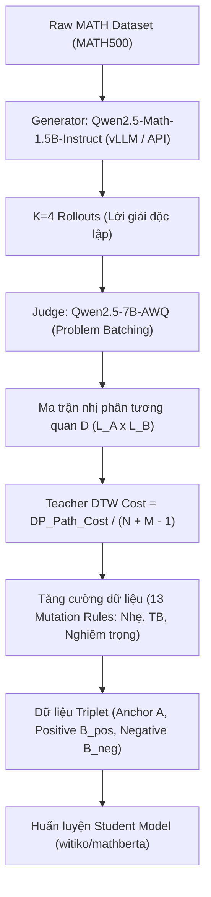
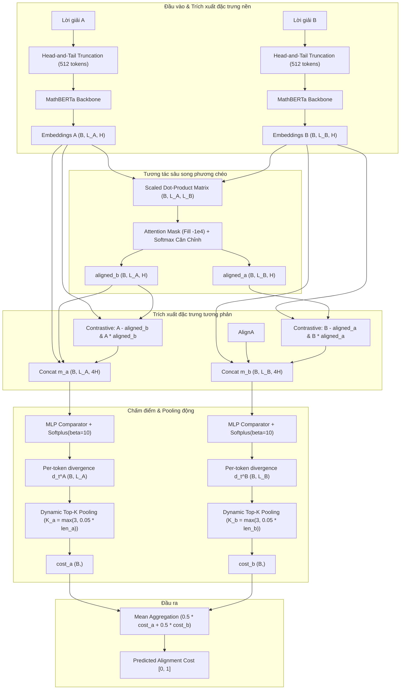

# Hướng Dẫn Chi Tiết Quy Trình Distillation & Huấn Luyện Student Model
## (Phase 1 $\rightarrow$ Phase 1.5 $\rightarrow$ Phase 2)

Tài liệu này tổng hợp toàn bộ quy trình khoa học dữ liệu từ các bước sinh dữ liệu gốc, chấm điểm tự động bằng Judge Model, tăng cường dữ liệu đột biến (Augmentation), đến thiết lập cấu hình huấn luyện chi tiết cho mô hình học sinh (Student Model). 

---

## 0. MỤC ĐÍCH CỦA GIAI ĐOẠN (PHASE GOAL & SIGNIFICANCE)

Giai đoạn này tập trung vào bài toán **Căn chỉnh Logic thông qua Chưng cất tri thức (Logical Alignment via Knowledge Distillation)**.

1. **Mục đích khoa học**:
   - Truyền tải (distill) khả năng nhận diện logic toán học tinh vi và đối sánh bước lập luận (symbolic-level trajectory alignment) từ các mô hình giám khảo khổng lồ (Teacher/Judge LLMs như Qwen2.5-7B/Llama-3-8B) sang một mô hình học sinh cực kỳ gọn nhẹ (**Student Model - MathBERTa với chỉ 110 triệu tham số**).
   - Khắc phục triệt để lỗi **Semantic Bias** (thiên lệch ngữ nghĩa do trùng lặp từ vựng nhưng sai khác dấu logic) của các mô hình nhúng truyền thống bằng kiến trúc tương tác sâu (Deep Interaction).
   - **Chấm điểm và phát hiện độ lệch (bias/inconsistencies) giữa các bước suy luận (reasoning steps)**: Đảm bảo phát hiện các lỗi ngụy biện toán học hoặc các bước suy luận nhảy vọt không hợp lệ, ngay cả khi chúng có bề ngoài viết rất giống lời giải chuẩn (lexical similarity cao).
2. **Giá trị ứng dụng thực tế**:
   - **Tối ưu tài nguyên & Tốc độ**: Thay vì phải gọi các LLM nặng nề tốn hàng giây và chi phí API cao cho mỗi bước suy luận trong quá trình RL/GRPO, Student Model siêu nhẹ có thể thực hiện căn chỉnh quỹ đạo lập luận (Trajectory Alignment) trực tiếp trên GPU cá nhân hoặc CPU với độ trễ tối thiểu (Inference $O(N)$).
   - **Đánh giá logic & Ổn định hóa GRPO (Reward Modeling)**: Cung cấp bộ chấm điểm độ lệch (Divergence Cost) chi tiết trên từng ký tự/token giữa các bước suy luận. Trong huấn luyện **GRPO (Group Relative Policy Optimization)**, khi chính sách (Policy) sinh ra một nhóm (Group) các rollouts song song cho cùng một câu hỏi, các bước suy luận (reasoning steps) giữa các rollouts này thường rất không ổn định (unstable/inconsistent). Student Model hoạt động như một bộ kiểm định logic thời gian thực để phạt/thưởng tức thì cho các bước đi sai hướng, làm mịn tín hiệu phần thưởng (dense reward) và giúp GRPO hội tụ nhanh chóng vào quỹ đạo lập luận chuẩn xác.

---

## 1. PHASE 1: SINH DỮ LIỆU OFFLINE (DATA GENERATION)
*Dựa trên mã nguồn từ [phase1_data_generation.ipynb](file:///c:/Users/nhanha213/OneDrive%20-%20hcmut.edu.vn/Desktop/STUDY/NCKH/SELF/conference-latex-template/Code/phase1_data_generation.ipynb)*

### Mục tiêu
Tạo ra các bước lập luận giải toán (Rollouts/Trajectories) khác nhau cho từng bài toán trong tập dữ liệu MATH để làm tài nguyên huấn luyện và đối chuẩn.

### Quy trình chi tiết
1. **Khởi tạo dữ liệu**: Tải các bài toán toán học từ tập MATH (ví dụ: MATH500).
2. **Mô hình sinh (Generator)**:
   - Sử dụng mô hình **`Qwen/Qwen2.5-Math-1.5B-Instruct`** chạy cục bộ thông qua thư viện `vLLM` (hoặc gọi API bên thứ ba như OpenRouter API để chạy trên CPU không cần GPU).
   - Với mỗi bài toán, cấu hình Generator sinh ra **$K=4$ rollouts** (lời giải) độc lập thông qua kỹ thuật sampling nhiệt độ cao.
3. **Cơ chế Caching**:
   - Lưu trữ các rollouts thu được dưới dạng file `.json` riêng biệt đặt tên theo hàm băm của đề bài (`hash(problem).json`) trong thư mục `rollouts_cache`.
   - Lưu trữ này giúp tiết kiệm tối đa chi phí API và tài nguyên GPU nếu quá trình chạy bị gián đoạn, chỉ cần đọc lại từ cache thay vì sinh mới từ đầu.

---

## 2. PHASE 1.5: CHẤM ĐIỂM BẰNG JUDGE MODEL (LABELING / JUDGING)
*Dựa trên mã nguồn từ [phase1_judge_only.ipynb](file:///c:/Users/nhanha213/OneDrive%20-%20hcmut.edu.vn/Desktop/STUDY/NCKH/SELF/conference-latex-template/Code/phase1_judge_only.ipynb)*

### Mục tiêu
Chấm điểm mức độ tương quan từng bước lập luận giữa các cặp lời giải khác nhau nhằm tạo ra nhãn Alignment Cost chi tiết cho mô hình học sinh.

### Quy trình chi tiết
1. **Mô hình giám khảo (Judge)**:
   - Sử dụng mô hình **`Qwen2.5-7B-AWQ`** (hoặc bản Quantized tương đương) chạy qua engine `vLLM` để đảm bảo tốc độ suy luận nhanh nhất trên GPU.
2. **Tối ưu hóa hàng loạt (Problem Batching)**:
   - Thay vì chấm từng cặp đơn lẻ (tốn chi phí overhead), hệ thống gom nhóm **20 bài toán (tương đương khoảng 120 cặp rollout)** đưa vào GPU xử lý đồng thời trong một lô (Batch Judging).
3. **Gán nhãn Alignment Cost & Tối ưu hóa Linear Prompting**:
   - **Tối ưu hóa chi phí gọi LLM**: Thay vì so sánh từng cặp câu đơn lẻ gây độ phức tạp lũy thừa $O(L_A \times L_B)$ cuộc gọi API, hệ thống sử dụng cơ chế **Linear Prompting**. Cả 2 lời giải được đánh chỉ mục bước và gửi chung trong 1 Prompt. Judge LLM phân tích toàn bộ cấu trúc và xuất ra ma trận tương quan nhị phân $D$ kích thước $L_A \times L_B$ (với $1$ là tương đương logic và $0$ là lệch lạc) chỉ trong **một lượt Forward duy nhất ($O(1)$)**.
   - Chi phí Teacher DTW được tính từ ma trận này bằng thuật toán Quy hoạch động:
     $$\text{Teacher DTW Cost} = \frac{\text{DP\_Path\_Cost}}{N + M - 1}$$
   - Kết quả cuối cùng được xuất ra file JSON Lines: `distillation_data.jsonl`.

---

## 3. TĂNG CƯỜNG DỮ LIỆU & GÁN NHÃN ĐỘT BIẾN (DATA AUGMENTATION & HARD NEGATIVES)
*Chi tiết cơ chế tăng cường dữ liệu chống Semantic Bias*

### Vấn đề cốt lõi
Các mô hình nhúng thường bị lỗi "Semantic Bias" khi chỉ nhìn vào sự trùng lặp từ vựng và đánh giá sai các câu có dấu ngược nhau. Để khắc phục, ta tiêm các lỗi logic toán học chí mạng để tạo ra các **Hard Negatives** (cost cao nhưng trùng lặp từ vựng cực lớn).

### 13 Quy tắc Mutation chuyên biệt
Hệ thống sử dụng các hàm đột biến mã nguồn để biến đổi các rollouts đúng thành sai theo 3 mức độ nghiêm trọng (Severity):
- **Mức Nhẹ (Cost 0.3)**: `Mutate Noise` (Chèn định lý lạc đề vào giữa), `Mutate Number` (Thay đổi nhẹ hằng số bằng Regex), `Mutate Circular` (Đưa kết luận lên làm giả thiết), `Mutate Conclusion Swap` (Đánh tráo kết luận với bài toán khác).
- **Mức Trung Bình (Cost 0.4)**: `Mutate Deletion` (Xóa một bước lập luận), `Mutate Proof Direction` (Đảo ngược chiều suy luận If-Then), `Mutate Notation` (Đảo ký hiệu toán học ví dụ $\cup \leftrightarrow \cap$), `Mutate Scrambling` (Trộn thứ tự các bước).
- **Mức Nghiêm Trọng (Cost 0.5)**: `Mutate Sign` (Đảo dấu cộng/trừ/nhân/chia), `Mutate Quantifier` (Đảo $\forall \leftrightarrow \exists$), `Mutate Shortcut` (Nhảy cóc từ đề bài ra kết luận), `Mutate Keyword` (Đảo từ khóa logic), `Mutate Negation` (Thêm phủ định), `Mutate Fatal Logic` (Universal Fallback: Chèn câu khẳng định $1=0$).

### Chiến lược Xây dựng Triplet huấn luyện & Bảo chứng Đột biến
- **Cam kết chất lượng Đột biến (No Re-verification)**: Hệ thống **không** chạy lại mô hình Judge để kiểm thử các mẫu đột biến này trước khi train nhằm tối ưu hóa hiệu năng tính toán. Chất lượng logic được bảo chứng bằng:
  1. *Tính bảo toàn ngữ cảnh*: Đột biến được so sánh với **Đề bài gốc cố định (Fixed Prompt)**. Việc thay đổi hằng số hoặc đảo dấu ở các bước biến đổi trung gian của lời giải chuẩn chắc chắn sẽ tạo ra lỗi ngụy biện toán học hoặc sai lệch nghiệm so với đề bài.
  2. *Quy tắc đột biến cam kết cao*: Các hàm Python được lập trình chặt chẽ và không thể tự khôi phục tính đúng đắn (ví dụ: đổi ký hiệu $\cup \leftrightarrow \cap$ hoặc chèn mệnh đề vô lý $1=0$).
- **Tỷ lệ Pos:Neg $\approx$ 1:1**: Thực hiện sinh chính xác 1 Negative cho mỗi Positive thông qua vòng lặp Target Severity tuần tự để giữ phân phối cân bằng lý tưởng.
- **Bảo toàn cấu trúc Anchor**: Sử dụng băm `hashlib.md5` để phân nhóm Anchor. Loại bỏ hoàn toàn fallback toàn cục (Global negative) nhằm tránh làm nhiễu cấu trúc triplet.
- **Biên an toàn (Margin)**: Đặt Positive Threshold $\le 0.10$ và Negative Threshold $\ge 0.30$. Khoảng nhãn xám $[0.11 - 0.29]$ bị loại bỏ hoàn toàn để tạo ra ranh giới vector rõ ràng, tự động lọc sạch các đột biến không mong muốn.

---

## 4. PHASE 2: THIẾT KẾ KIẾN TRÚC STUDENT MODEL
*Dựa trên mã nguồn từ [phase2_student_training.ipynb](file:///c:/Users/nhanha213/OneDrive%20-%20hcmut.edu.vn/Desktop/STUDY/NCKH/SELF/conference-latex-template/Code/phase2_student_training.ipynb)*

### Backbone & Xử lý Đầu vào
- **Backbone**: Chuyển hoàn toàn sang **`witiko/mathberta`** (Pre-trained trên dữ liệu LaTeX và tài liệu toán học chuyên sâu).
- **Head-and-Tail Truncation**: Cắt lấy 256 tokens từ đầu (giữ giả thiết) và 256 tokens từ cuối (giữ kết luận) để giới hạn chiều dài tối đa là 512 tokens mà không làm mất thông tin logic quan trọng nhất.

### Kiến trúc Tương tác Sâu (ESIM-style Deep Interaction)
1. **Softmax Alignment**: Tính toán ma trận Attention song phương chéo (Cross-attention) giữa các token của Câu A và Câu B. Chia tỷ lệ cho $\sqrt{H}$ (Scaled Dot-Product) để tránh triệt tiêu gradient, sau đó Softmax để căn chỉnh `B_aligned`.
2. **Trích xuất đặc trưng tương phản (Contradiction Features)**:
   Ghép 4 luồng thông tin để kích hoạt vùng phát hiện lỗi sai logic:
   $$m_a = [A, B_{\text{aligned}}, A - B_{\text{aligned}}, A \times B_{\text{aligned}}]$$
3. **MLP Comparator**: Đưa $m_a$ qua mạng MLP 2 lớp ẩn kết thúc bằng **`Softplus(beta=10)`** để tạo ra điểm số divergence per-token $d_t \ge 0$ (tránh hiện tượng đóng băng gradient của hàm ReLU truyền thống).
4. **Dynamic Top-K Pooling Per-Sample**:
   Tính số lượng tokens pooling động theo độ dài thực tế của từng câu:
   $$K_i = \max\left(3, \lfloor 0.05 \times \text{len}_i \rfloor\right)$$
   Tiến hành sắp xếp và lấy trung bình cộng điểm số của Top-K tokens này để ra chi phí một chiều $cost_a$.
   * *Ý nghĩa tỷ lệ 5%*: Đại diện cho chiều dài trung bình của một bước toán học/công thức đơn lẻ. Việc lấy Top-K giúp cô đọng điểm số sai lệch vào vùng có lỗi nghiêm trọng nhất.
   * *Khắc phục lỗi Overfit từ khóa*: Do cơ chế self-attention của MathBERTa diễn ra trước khi pooling, vector của mỗi token đều mang thông tin ngữ cảnh sâu (Contextualized Representation). Khi xảy ra đứt gãy logic âm thầm ở giữa, toàn bộ phân đoạn toán học phía sau sẽ bị mất liên kết logic, khiến một cụm lớn tokens có điểm divergence $d_t$ cao. Việc pooling Top-5% trung bình cộng sẽ thu trọn được sự đứt gãy vùng này thay vì chỉ hội tụ cục bộ vào một vài từ khóa.
5. **Mean Aggregation**:
   Tổng hợp chi phí đối xứng bằng trung bình cộng:
   $$\text{Distance} = 0.5 \times cost_a + 0.5 \times cost_b$$

---

## 4.5. ỨNG DỤNG TRONG VÒNG LẶP GRPO (STABILIZATION & SCALING)

Khi ứng dụng Student Model làm Reward Model trong huấn luyện **GRPO (Group Relative Policy Optimization)** với số lượng rollouts lớn trong một nhóm (ví dụ $G = 64$):
* **Cơ chế neo điểm (Reference-based Alignment)**: Để tránh độ phức tạp bậc hai $O(G^2)$ khi so sánh chéo tất cả các rollouts với nhau, Student Model thực hiện đối sánh song phương chéo giữa $G$ rollouts sinh ra với **chỉ duy nhất một Lời giải chuẩn (Reference/Anchor)**.
* **Độ phức tạp tuyến tính $O(G)$**: Số lượng phép tính giảm xuống còn đúng $G$ phép so sánh. Nhờ MathBERTa siêu nhẹ (110M), 64 phép so sánh này được GPU song song hóa hoàn toàn và xử lý tức thì, hoạt động như một dense reward định hướng logic thời gian thực và ổn định hóa các bước suy luận bị chập chờn (unstable reasoning steps) giữa các rollouts của GRPO.

---

## 5. THIẾT LẬP CẤU HÌNH HUẤN LUYỆN (TRAINING SETTINGS)

### Hàm mục tiêu Multi-Task Loss
Mô hình tối ưu hóa đồng thời khoảng cách tuyệt đối (MSE) và thứ hạng tương đối (Triplet Loss):
$$\mathcal{L}_{\text{total}} = \mathcal{L}_{\text{MSE}} + \lambda_{\text{epoch}} \cdot \mathcal{L}_{\text{Triplet}}$$
* Trong đó, $\mathcal{L}_{\text{Triplet}} = \max\left(0, cost_{\text{pos}} - cost_{\text{neg}} + 0.2\right)$ với margin $m=0.2$.
* Hệ số $\lambda_{\text{epoch}}$ được cấu hình tăng dần từ $0.1$ (tại Epoch 1-2) lên đến $1.0$ để tránh shock gradient ở các epoch đầu.

### Thiết lập Hyperparameters & Tối ưu hóa GPU
| Tham số / Thiết lập | Giá trị mặc định | Giải thích chi tiết |
| :--- | :--- | :--- |
| **Model Backbone** | `witiko/mathberta` | Mở khóa toàn bộ trọng số (`freeze_backbone=False`) |
| **Optimizer** | AdamW | Bộ tối ưu hóa tiêu chuẩn cho Transformers |
| **Learning Rate** | $2 \times 10^{-5}$ | LR nhỏ giúp quá trình tinh chỉnh ổn định |
| **Batch Size** | 8 | Phù hợp với giới hạn VRAM GPU T4/L4 trên Google Colab |
| **Accumulation Steps** | 4 | Tích lũy gradient qua 4 bước tạo Batch size ảo = 32 |
| **Scheduler** | Linear Warmup | Warmup 10% tổng số steps để ổn định LR ban đầu |
| **Mixed Precision** | FP16 (`GradScaler`) | Tăng tốc độ tính toán, Attention mask điền `-1e4` |
| **Gradient Checkpointing** | Dynamic Toggle | Bật trong lúc `train()` để tiết kiệm RAM, tắt khi `eval()` |
| **Early Stopping** | Patience = 3 | Dừng huấn luyện khi Validation Loss không giảm trong 3 Epoch |
| **Seed định sẵn** | 42 | Khóa cứng mọi hàm ngẫu nhiên để tái lập kết quả |

### Đánh giá & Giám sát (Evaluation Metrics)
1. **Kendall's $\tau$ Correlation**: Đo lường độ tương quan thứ hạng giữa khoảng cách dự đoán và khoảng cách thực tế trên toàn bộ phân phối dữ liệu Validation.
2. **Triplet Accuracy**: Đánh giá tỷ lệ phần trăm các bộ ba (Triplet) được phân loại đúng biên an toàn.
3. **Reshuffle Triplets**: Cứ sau 2 Epoch, tập Triplets sẽ được tái cấu trúc lại ngẫu nhiên để cung cấp các Hard Negatives mới cho mô hình học tập.

---

## 6. SƠ ĐỒ KIẾN TRÚC CHI TIẾT (ARCHITECTURE DIAGRAMS)

### Quy trình tổng quát (End-to-End Pipeline)

### Kiến trúc Student Model (ESIM-style Deep Interaction)

